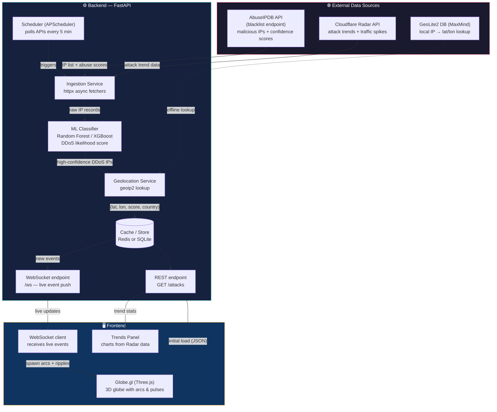

<p align="center">
  
</p>

<h1 align="center">NetFlare</h1>

<p align="center">
  Real-time cyber-attack visualization on a 3D globe.
</p>

<p align="center">
  
  
  
  
</p>

---

## Overview

NetFlare pulls malicious IPs from [AbuseIPDB](https://www.abuseipdb.com/), resolves
them to coordinates with MaxMind GeoLite2, and streams them to a React client that
plots each hit on an interactive globe. Global attack trends come from the
[Cloudflare Radar](https://radar.cloudflare.com/) API.

Attacks are cached in SQLite and drip-fed over a WebSocket, so the globe stays
live without hammering the upstream APIs.

## Features

- **Live globe** — attack arcs and impact points rendered with `react-globe.gl`
- **WebSocket stream** — new events pushed to every connected client
- **Trends panel** — Cloudflare Radar layer-7 timeseries, top origin and target countries
- **Event ticker** — scrolling feed of recent IPs with click-to-focus on the globe
- **Threat audio** — ambient severity cues driven by the current threat level
- **Persistent cache** — SQLite store survives restarts; upstream APIs polled on a schedule

## Demo

## Architecture



| Job                   | Interval  | Purpose                                    |
| --------------------- | --------- | ------------------------------------------ |
| `refresh_attack`      | 6 hours   | Fetch AbuseIPDB blacklist, geolocate, store |
| `refresh_trends`      | 1 hour    | Fetch Cloudflare Radar trends              |
| `replay_random_attack`| 3 seconds | Queue a stored attack to keep the feed live |

## Getting Started

### Prerequisites

- Python 3.11+
- Node.js 18+
- An [AbuseIPDB API key](https://www.abuseipdb.com/account/api)
- A [Cloudflare API token](https://dash.cloudflare.com/profile/api-tokens) with Radar read access
- The [GeoLite2 City](https://dev.maxmind.com/geoip/geolite2-free-geolocation-data) database

### Server

```bash
cd server
pip install -r requirements.txt          # or: uv sync
```

Place `GeoLite2-City.mmdb` in `server/data/`, then create `server/.env`:

```env
ABUSEIPDB_KEY=your_key_here
CLOUDFLARE_TOKEN=your_token_here
ALLOWED_ORIGINS=http://localhost:5173
```

Run it:

```bash
uvicorn main:app --reload
```

The API is live at `http://localhost:8000`.

### Client

```bash
cd client
npm install
npm run dev
```

The app is live at `http://localhost:5173`.

To point the client at a deployed backend, create `client/.env`:

```env
VITE_API_URL=https://your-server.onrender.com
VITE_WS_URL=wss://your-server.onrender.com/ws
```

## API Reference

| Method | Endpoint       | Description                                  |
| ------ | -------------- | -------------------------------------------- |
| `GET`  | `/`            | Health check                                 |
| `GET`  | `/attacks`     | 200 most recent attacks (lat, lng, score, country) |
| `GET`  | `/trends`      | Cached Cloudflare Radar trend data           |
| `GET`  | `/debug/fake`  | Queue a synthetic event (development only)   |
| `WS`   | `/ws`          | Live attack event stream                     |

## Configuration

| Variable           | Side   | Default                 | Description                          |
| ------------------ | ------ | ----------------------- | ------------------------------------ |
| `ABUSEIPDB_KEY`    | server | *required*              | AbuseIPDB API key                    |
| `CLOUDFLARE_TOKEN` | server | *required*              | Cloudflare Radar API token           |
| `ALLOWED_ORIGINS`  | server | `http://localhost:5173` | Comma-separated CORS origins         |
| `PORT`             | server | `8000`                  | Listen port                          |
| `VITE_API_URL`     | client | `http://localhost:8000` | REST base URL                        |
| `VITE_WS_URL`      | client | `ws://localhost:8000/ws`| WebSocket URL                        |

## Deployment

The server ships with a `render.yaml` and a `Procfile` for [Render](https://render.com/) —
set `ABUSEIPDB_KEY`, `CLOUDFLARE_TOKEN`, and `ALLOWED_ORIGINS` in the dashboard.

The client is a static Vite build (`npm run build`) and deploys to any static host
(Vercel, Netlify, Cloudflare Pages).

> **Note:** SQLite lives on the container filesystem. On ephemeral hosts the cache
> resets on redeploy and repopulates on first boot.

## Project Structure

```
NetFlare/
├── client/
│   ├── public/            # logo, icons, favicon
│   └── src/
│       ├── components/    # GlobeView, Ticker, TrendsPanel, StatusBar, Legend, BootOverlay
│       ├── hooks/         # useAttacks, useLiveEvents, useTrends
│       └── audio/         # threat-level audio cues
├── server/
│   ├── main.py            # FastAPI app, scheduler, WebSocket
│   ├── db.py              # SQLite schema, upserts, trend storage
│   ├── radar.py           # Cloudflare Radar client
│   ├── connection_manager.py
│   └── data/              # GeoLite2 DB + SQLite cache
└── render.yaml
```

## Acknowledgements

- [AbuseIPDB](https://www.abuseipdb.com/) — malicious IP reports
- [Cloudflare Radar](https://radar.cloudflare.com/) — global attack trends
- [MaxMind GeoLite2](https://www.maxmind.com/) — IP geolocation
- [react-globe.gl](https://github.com/vasturiano/react-globe.gl) — globe rendering

## License

[MIT](./LICENSE)